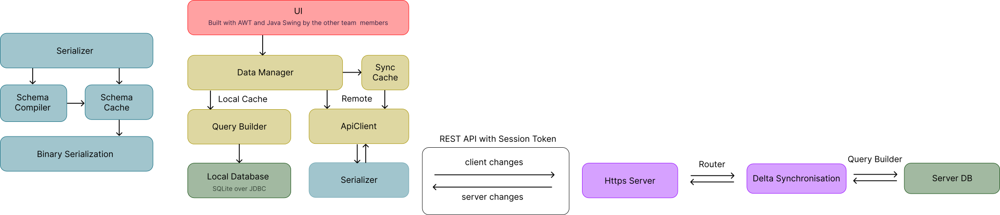

# Metis
An offline-first Todo-App with optional self-hosted cloud features.
Developed as a group project for the course "Informatik 2" at the University of Augsburg in the summer semester of 2026.

# Overview
The source code is split into three modules:
- `shared`: contains shared classes used by both the client and server including the serializer, the query builder, the sync logic and shared data models
- `client`: contains the client application including the ui, api client and data manager
- `server`: contains the server application including the https server, api router and routes and security


# Implementation
The UI was mainly written by the other team members and won't be covered in detail here.
## Serializer
### Architecture
The serializer generates and caches schemas for each class that it needs to serialize at runtime.
The schema provides instructions for how to serialize and deserialize the class, eliminating some of the reflection overhead that would otherwise be incurred through choosing the correct schema compiler based on the class type for every single object.
Different types need to be handled differently.
For example, objects need to recursively serialize their fields, while sealed interfaces and enums must tag each possible option.
Primitive arrays need special handling and records require using a different reflection API than normal classes.
### Generic type handling
In order to decide which compiler to use for a given class and find the right cached schema, the type of an object needs to be known at runtime.
This presents a unique challenge for generic types, as most of the type information is erased at runtime due to JVM behavior.
Using super type tokens as a workaround, the generic type of any object can be stored as a real Java object and manipulated at runtime.
With this technique even nested generics and type variables can be resolved through type introspection.
Usually these features come conveniently prepackaged in libraries like Gson or Guava, but since we were not allowed to use any external libraries besides JDBC, I had to implement them from scratch by myself.
### Adapters
The project comes with a modular adapter system that allows adding your own types to the serializer, including support for schema compilation.
To add your own type, you register your adapter using super type tokens.
This provides support for generic types and granular control over which types are supported by the adapter.
### Binary format
The output of the serializer is a custom binary format.
Sealed Interfaces and enums receive a tag indicating which option is being used, while objects and records have tags indicating the following field, allowing for any order of fields and optional fields.
Arrays are prefixed with their length, and other types have their own specific format.
A schema must be provided during serialization and deserialization, which saved space by not requiring the schema to be transmitted with the data.
The format is significantly more compact than equivalent JSON or XML, but is not human-readable, requires the schema to be known in advance, is less interoperable, and more challenging to debug.
Its size could theoretically be further reduced by using variable-length integers and compression.
## Synchronization
The sync logic uses a timestamp-based last-write-wins strategy on each field of an object to resolve conflicts.
This allows simultaneous edits on multiple clients to be merged without losing any data, provided that the edits are made on different fields.
New tasks are assigned a UUID to ensure that they are unique across all clients and the server.
When tasks are deleted, they receive a tombstone marker that is kept in the database and deleted once the deletion has been propagated to the server.
The server stores the tombstone for a configurable amount of time to allow clients that have not synced in a while to catch up.
If a client has not synced for longer than the tombstone's TTL, the server issues a full sync to the client.
The client application is usable even without an account.
Should a user have an account registered but be offline, the client will cache the changes in memory or the database and sync them once it goes back onlinle.
## Database & Query Builder
The database is a simple SQLite database stored as a file on the local filesystem.
The query builder provides a convenient DSL for interacting with the database.
The database repositories abstract away the underlying database structure into simple methods.
The query builder uses prepared statements to avoid SQL injection, and features transaction and batching support.
## Server & Auth
The server is based on the `com.sun.net.httpserver` package and provides a simple API to register routes, handle requests and headers, and return responses including status codes, errors, headers and serialized java objects.
A user must authenticate first before they can sync their data with the server.
After registering, the password is hashed using a combination of a pepper and salt and stored in the database.
Logging in returns a JWT-style session token encoded with the server's secret key that can be used for future synchronization attempts.
Session tokens, however, currently lack expiration and refresh logic.


# Quick start
The project has been tested with JDK 21, other versions might or might not work.
```sh
# Run the server (optional if you want to test out the account and sync features)
./gradlew :server:run
# Run the client application in a separate terminal
./gradlew :client:run
```

The repo is configured for testing and developing locally using a local server and client by default.
If you intend to deploy the server to production, please ensure that you modify the configuration as the provided defaults are insecure.
For further information on how to build and configure the application, please view the project's [BUILD.md](BUILD.md) file.

# Tradeoffs and known limitations
- The query builder was a bit unnecessary because I originally wanted to implement a real ORM, but due to time constraints, I didn't manage to.
- The reflection-based serializer is somewhat inefficient due to runtime reflection overhead even with cached schema generation. This could be solved using compile time code generation but was not within this project's scope.
- The sync logic has some bugs and edge cases due to insufficient time for extensive testing, and likely many antipatterns that I don't know of yet, since this is my first time doing anything related to distributed systems. Still, this was a worthwhile learning experience that taught me many things you need to consider when building distributed systems.

# License

This project is licensed under the GNU General Public License v3.0 or later.
